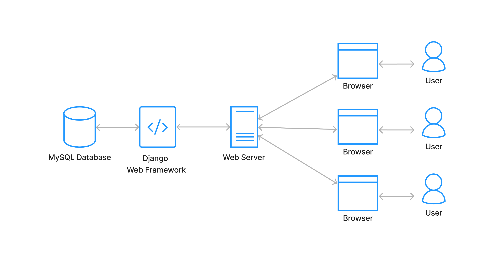
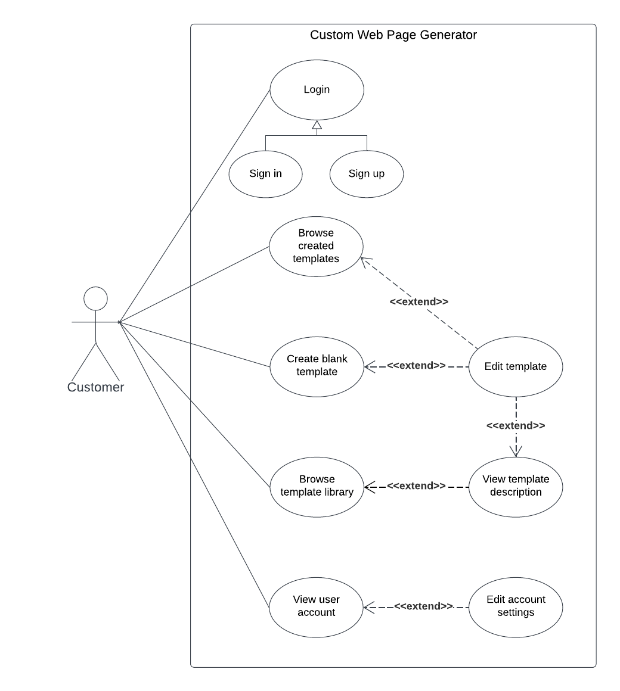
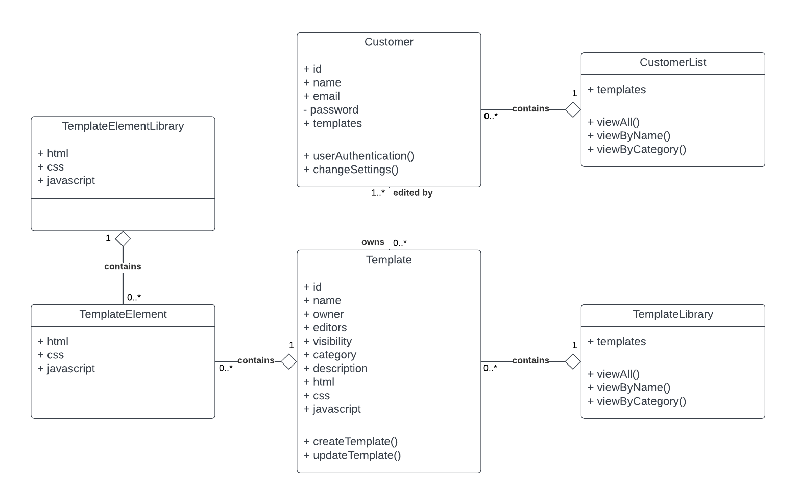
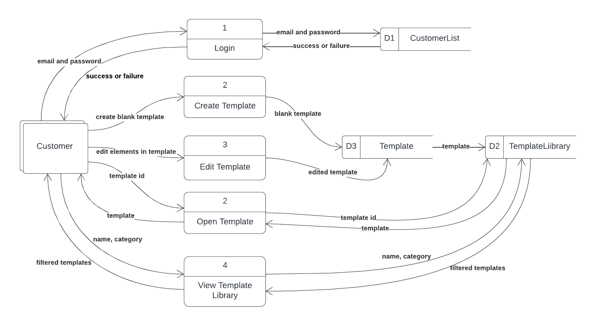
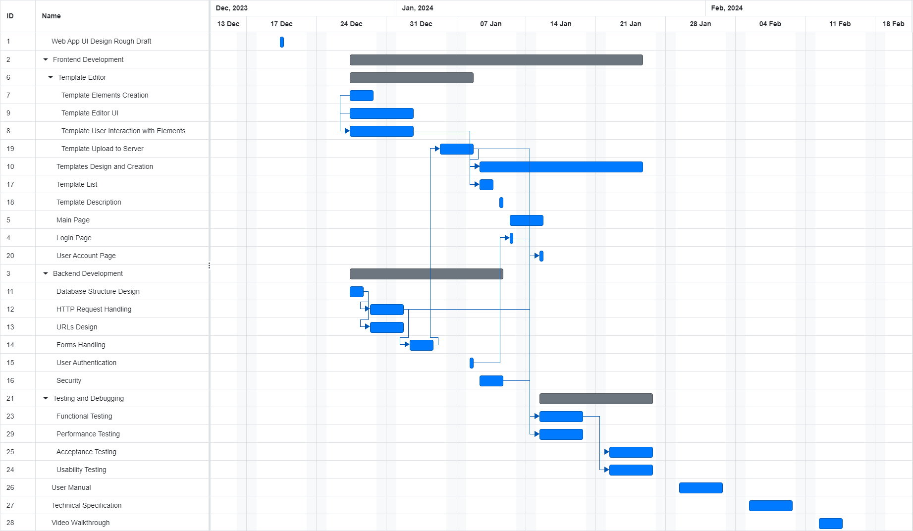

# Table of Contents

1. [Introduction](https://gitlab.computing.dcu.ie/wooh2/2024-ca326-aumak-customwebpagegenerator/-/blob/main/functional_spec/Functional_Specification.md?ref_type=heads#1-introduction)

2. [General Description](https://gitlab.computing.dcu.ie/wooh2/2024-ca326-aumak-customwebpagegenerator/-/blob/main/functional_spec/Functional_Specification.md?ref_type=heads#2-general-description)

3. [Functional Requirements](https://gitlab.computing.dcu.ie/wooh2/2024-ca326-aumak-customwebpagegenerator/-/blob/main/functional_spec/Functional_Specification.md?ref_type=heads#3-functional-requirements)

    1. [Template Editor](https://gitlab.computing.dcu.ie/wooh2/2024-ca326-aumak-customwebpagegenerator/-/blob/main/functional_spec/Functional_Specification.md?ref_type=heads#31-template-editor)
    2. [Template Library](https://gitlab.computing.dcu.ie/wooh2/2024-ca326-aumak-customwebpagegenerator/-/blob/main/functional_spec/Functional_Specification.md?ref_type=heads#32-template-library)
    3. [Login](https://gitlab.computing.dcu.ie/wooh2/2024-ca326-aumak-customwebpagegenerator/-/blob/main/functional_spec/Functional_Specification.md?ref_type=heads#33-login)
    4. [Main Page](https://gitlab.computing.dcu.ie/wooh2/2024-ca326-aumak-customwebpagegenerator/-/blob/main/functional_spec/Functional_Specification.md?ref_type=heads#34-main-page)
    5. [Template Description](https://gitlab.computing.dcu.ie/wooh2/2024-ca326-aumak-customwebpagegenerator/-/blob/main/functional_spec/Functional_Specification.md?ref_type=heads#35-template-description)
    6. [User Account Settings](https://gitlab.computing.dcu.ie/wooh2/2024-ca326-aumak-customwebpagegenerator/-/blob/main/functional_spec/Functional_Specification.md?ref_type=heads#36-user-account-settings)
    7. [Tutorial](https://gitlab.computing.dcu.ie/wooh2/2024-ca326-aumak-customwebpagegenerator/-/blob/main/functional_spec/Functional_Specification.md?ref_type=heads#37-tutorial)

4. [System Architecture](https://gitlab.computing.dcu.ie/wooh2/2024-ca326-aumak-customwebpagegenerator/-/blob/main/functional_spec/Functional_Specification.md?ref_type=heads#4-system-architecture)  

5. [High-Level Design](https://gitlab.computing.dcu.ie/wooh2/2024-ca326-aumak-customwebpagegenerator/-/blob/main/functional_spec/Functional_Specification.md?ref_type=heads#5-high-level-design)
    
    1. [Use Case Diagram](https://gitlab.computing.dcu.ie/wooh2/2024-ca326-aumak-customwebpagegenerator/-/blob/main/functional_spec/Functional_Specification.md?ref_type=heads#use-case-diagram)
    2. [Class Diagram](https://gitlab.computing.dcu.ie/wooh2/2024-ca326-aumak-customwebpagegenerator/-/blob/main/functional_spec/Functional_Specification.md?ref_type=heads#class-diagram)
    3. [Data Flow Diagram](https://gitlab.computing.dcu.ie/wooh2/2024-ca326-aumak-customwebpagegenerator/-/blob/main/functional_spec/Functional_Specification.md?ref_type=heads#data-flow-diagram)

6. [Preliminary Schedule](https://gitlab.computing.dcu.ie/wooh2/2024-ca326-aumak-customwebpagegenerator/-/blob/main/functional_spec/Functional_Specification.md?ref_type=heads#6-preliminary-schedule)

7. [Appendices](https://gitlab.computing.dcu.ie/wooh2/2024-ca326-aumak-customwebpagegenerator/-/blob/main/functional_spec/Functional_Specification.md?ref_type=heads#7-appendix)

---

# 1. Introduction 

## 1.1 Overview

This project involved creating a product that allows users to develop an interactive web application, allowing users to create and customize webpage templates with little to no effort. Our main aim throughout this project was to cater to users with little to no coding experience, this may be due to a lack of time or lack of interest in the field, however through this product users who wish to create websites can still do so without having to go through multiple classes to learn languages like HTML, CSS, Javascript. This product makes the entire process a comfortable experience for the user. 
The product allows users to modify HTML elements within the template for elements like navigation bars, texts and all forms of media, things being done through the drag-and-drop functionality. This allows for an intuitive editing space for new users who are just using this but also for experienced users, we hope to create a space that requires little to no training period to learn how to use. 

Moreover, in order to create a sense of community within the world of editing web pages, there is also a collaborative feature. The collaborative feature allows users to upload their own templates, this will entail not only publishing their final website but also including details such as what the website design entails, aesthetics they feel it appeals to and much more. This feature will also allow users to get inspiration from published templates, users can download templates other users have downloaded and edit the webpage to fit their specific criteria of what they are looking for. 

## 1.2 Business Context

Not applicable.

## 1.3 Glossary

### Drag and drop   
In graphical user interfaces for computers, drag and drop is a gesture performed with a pointing device. It involves the user selecting a virtual object by "grabbing" it and then moving or dropping it to a different location or onto another virtual object.

### HTML
Stands for Hypertext Markup Language, allows for a consistent way to add style and links to text files for web pages.

### CSS
Stands for Cascading Style Sheets is a style sheet language. Mainly used for defining the presentation of any markup language, in this case, it will be HTML. 

### JavaScript
An object-oriented computer programming language. It is often used to create interactive features within web browsers.

### Pagination
Where a user navigates between pages by using links such as "next", "previous", and page numbers. 

### Infinite Scroll
A feature that allows users to load pictures only on the part of the website where the users are currently on and load more once users scroll down.

### Repository
Digital storage space that developers use to make and manage changes to a source code.

### Access Rights
The rights held by a user or computer program to view, alter, or remove data.

### Encryption Protocols
A method by which information is converted into secret code that hides the information's true meaning.

### User-Friendly Interface
A software where the user can understand with ease and navigate through the application with little to no problems.

---

# 2. General Description

## 2.1 Product / System Functions

At its core, the main idea of our product is the development of a dynamic web application. Our target demographic for our project is people without any programming expertise, to allow them to easily craft and tweak webpage designs. The core features of our product are listed below. 

_Template Editor_

The Template Editor is a feature that allows users to manipulate HTML elements within the webpage.  The customization feature allows users to create their very own version of their webpage, furthermore, the editor also allows users to save and export templates. 

_Template Library_

The template library is a library we created for users who may need help when it comes to creating their own custom websites. The library allows users to browse, preview, and edit templates. Users can also filter, sort and search through this library 

_Login page_

The login page provides a level of safety when it comes to users' accounts. Each account has their own username and password that is unique to their account. We also have a recovering lost password in case users forget. First-time users can sign up here as well. 

_Main Page_

The main page allows access to all other pages, it acts as a home that users will constantly come back to. This is where users can access the template editor, and the template library, access their own templates, view recommended templates, view their account settings and for first-time users they will receive a tutorial on how to navigate the main page with ease. 

_Template Description_

Each template will have a template description, users who wish to publish their templates can change the details and settings of their template to allow other users to understand what the template is about. 

_User Account Settings_

The user account page allows users to change their profile details such as email, password and user image. 

Our main aim is to ensure the interface is user-friendly to allow smooth navigation and effortless template management. We encourage collaboration through our template library feature. 
All features join together to create perfectly and guarantee a seamless and intuitive user experience.

## 2.2 User Characteristics and Objectives

The user community consists of users with little to no programming knowledge but who wish to create personalised and interactive web page designs. The aim is to create a system that caters to these individuals and create an intuitive, user-friendly platform for easy template customization. 

The objectives for the system from the user's perspective are - 

_Convenience_

Providing a platform that doesn't require any programming skill, allowing users to navigate, edit, and manage a webpage efficiently with little to no effort. 

_Collaborative Environment_

Assist in the progress of creating a sense of community through collaboration from the Template Library. Allowing users to browse, edit, and share templates

_Account Security_

Adding login and account setting features to ensure users that their accounts are secure, also allowing users to personalise their profiles, and manage and/or recover passwords.

_Tutorial_

Providing learning support for first-time users to accustom themselves to the platform's features and functionalities.

_Template Description_

Allowing users to describe and modify their template details in the template description, allows for clearer communication and understanding of shared templates within the community.

Our product entails user-friendly navigation, template management and collaboration within a secure and supportive environment, these align with user expectations. Furthermore, it ensures simplicity for non-programmers to empower users to create and share their customers' interactive webpage designs. 

## 2.3 Operational Scenarios

_Template Customization _

The user will access the template Ediotr from the main page. They will then select a basic template and start customizing by dragging and dropping elements into the template. The users can change colours, change fonts, add images, add different forms of media, and arrange and rearrange the sections using the simple interface. Once the user is satisfied they will save the template to their account. 

_Template Library _

Starting from the main page, the user will navigate to the Template Library. Users can filter through templates based on categories, sort by popularity and search for specific designs. After the users find a template they are interested in, they will read the description to get a better understanding of the overall layout of the structure and design. Once the users decide on their template after careful consideration, the user will then proceed to clone the template into their own template editor. the user will then move to the Template Editor and make alterations to the cloned template. 

_Account Management _

The user goes to User Account Settings which is easily accessible from the main page. This is where they will modify their profile details, change the profile image and update the email addresses they wish to associate with. As a security measure, the user can change their password by following the steps mentioned in the setting to ensure a safe change in passwords. 

_Template Description and Publishing _

After creating a unique template using the Template Editor, the user will make their way to the template description section. Here they will provide a detailed description, select visibility options and ensure the template settings align with their intentions to share with the public. once published, other users in the community can view, clone and collaborate on the template. 

_First-time User Tutorial _

After registering, the user will be directed to the main page where they will be offered a tutorial option. The users who choose the tutorial will be introduced to how to navigate the different sections, go through the Template Editor, and Template Library and manage their account settings. After the tutorial users will feel confident in navigating the platform. 

## 2.4 Constraints

_Performance and Speed Requirements _

Ensuring that webpages created using the system load quickly to provide a seamless user experience. Furthermore, The Template Editor should respond swiftly to user interactions like drag and drop, ensuring a smooth editing experience. 

_Industry Standards _

Adhere to industry-standard HTML, CSS, and JavaScript practices for compatibility across all different types of devices. Also, implement security measures to protect user data, especially during login. 

_Compatibility with Platforms_

Ensure the system works well across all various devices such as desktops, laptops, tablets, and mobile phones and also across all major web browsers such as Chrome, Firefox, Safari, Edge, etc.

_User Interface _

Encouraging users with disabilities to navigate and use the system effectively by following usability best practices to create an intuitive and user-friendly interface.

_Development Constraints _

Use technologies that align with the project's goal and are also scalable for future enhancements, these would entail considering budgetary and time constraints

---
# 3. Functional Requirements

## 3.1 Template Editor

### Description

The Template Editor empowers users to create or modify HTML elements within webpage templates.

Basic Templates:  
The editor offers a variety of basic templates, each featuring distinct page layouts. These templates are designed to provide users with a diverse combination and arrangement of HTML elements.

Customization Options:  
Users have the flexibility to customize their chosen template. The Template Editor provides a comprehensive list of preset HTML elements, including navigation bars, sections, paragraphs, and lists. Through a simple [drag and drop](https://gitlab.computing.dcu.ie/wooh2/2024-ca326-aumak-customwebpagegenerator/-/blob/main/functional_spec/Functional_Specification.md?ref_type=heads#drag-and-drop) interface, users can select elements from the list and position them on the template. Once placed, users can easily edit the content of these elements. For text elements like headers, paragraphs, and lists, a double-click allows users to enter and modify the text within the container. Additionally, users can upload images and videos, placing them in the template through [drag and drop](https://gitlab.computing.dcu.ie/wooh2/2024-ca326-aumak-customwebpagegenerator/-/blob/main/functional_spec/Functional_Specification.md?ref_type=heads#drag-and-drop) actions.

Color Palette:  
The editor enables users to create a personalized color palette. These colors are automatically applied to the template, serving as font colors or background colors. Users can further refine the appearance by using a color picker to edit the font color or background color of each individual element.

Saving and Exporting:  
Upon completing the template edits, users can save their work to the system database. Furthermore, the editor facilitates the export of templates in a zip file format. This file includes HTML, CSS, and JavaScript files, along with any uploaded image and video files, providing users with a comprehensive package for their customized templates.

### Criticality: High

The Template Editor stands as the paramount feature within our application. Given that our application is expressly designed to offer a user-friendly tool for non-programmers to create and edit webpage designs, the Template Editor plays a pivotal role in fulfilling this core objective. 

### Technical Issues

The design of the Template Editor interface should prioritize ease of learning and memorization. Given that the application caters to non-programmers, it's essential to replace technical terms like HTML tags with more user-friendly language to enhance the overall learnability of the interface.  

To provide users with a greater degree of flexibility in template design, the Template Editor should offer a diverse range of HTML elements.  

A critical consideration pertains to whether the template modifications should be automatically updated in the system database or manually saved by the user after clicking the "save" button. While autosaving is more convenient for users, it's crucial to assess its potential impact on server workload and system performance. Balancing convenience with performance implications is paramount in making an informed decision regarding the save mechanism.  

### Dependencies with Other Requirements

Template Library:  
Templates crafted through the Template Editor will appear in the Template Library if set to public visibility.
Users can select a template from the library, create a clone, and subsequently make modifications using the Template Editor.  

Main Page:  
Templates, whether created or edited by a user, will be showcased on the user's main page.
Users can either download these templates or continue to make further modifications.
The main page offers an option for users to access and open the Template Editor.  

Template Description:  
The Template Description page provides users with the option to duplicate a template and initiate modifications using the Template Editor.

Tutorial:  
Tutorial guides users through Template Editor interface.  

## 3.2 Template Library

### Description

The Template Library serves as a repository for both preset templates and public templates contributed by other users.  

Template Preview:  
Users can explore the Template Library and preview templates by clicking on them. A detailed template description is available upon selection.

Template Edit:  
To utilize a template, users can conveniently double-click to create a copy. This copy can then be edited using the Template Editor to suit individual preferences and requirements.

Navigation:  
The Template Library incorporates filters, allowing users to refine template listings based on categories. 
Users can also sort the list of templates based on popularity or date added.
For efficient searching, users have the ability to search for templates based on template name, username, or categories.

### Criticality: High

The Template Library holds a pivotal role in our application, enabling users to access templates created by their peers. This functionality aligns with our objective of providing a collaborative platform for users to share and engage with diverse design creations.

### Technical Issues

Presentation:  
The Template Library should be displayed in an aesthetically pleasing and user-friendly format, ensuring a positive and engaging user experience.  

Information Visibility:  
Each template within the library should present sufficient information, such as a visual preview, template name, and relevant categories, so that users can quickly assess whether a template aligns with their specific needs.  

Navigation Efficiency:  
To facilitate efficient template exploration, the Template Library should offer user-friendly navigation tools. This ensures that users can easily find the templates they are looking for.  

Pagination vs. Infinite Scroll:  
In determining the technical approach for the Template Library, a crucial decision involves choosing between pagination and infinite scroll. Here are the considerations for each option:

- Pagination:  
    - Controlled Access: Separates templates into pages, requiring users to click on "next page" to view a different list.  
    - Prevents Slowdowns: Helps prevent potential slowdowns by controlling the number of templates loaded at once.  
    - Enhanced Responsiveness: Contributes to a more responsive web application.  

- Infinite Scroll:  
    - Continuous Loading: Templates load automatically as users scroll down, offering a seamless browsing experience.  
    - Potential for Slowdown: Loading too many templates simultaneously might impact the web application's responsiveness.  

This decision should be made based on the specific needs and priorities of the application, ensuring an optimal balance between user experience and system performance.  

### Dependencies with Other Requirements

Template Editor:  
Templates generated through the Template Editor will be showcased in the Template Library if designated as publicly visible.
Users can choose a template from the library, create a duplicate, and subsequently make modifications using the Template Editor.  

Main Page:  
The main page provides users with an option to access the Template Library.  

Template Description:  
Users have the ability to access detailed information about a template in the Template Library by clicking on it.  

Tutorial:  
Tutorial guides users on navigating to the Template Library and how they can edit the templates provided in the Template Library.  

## 3.3 Login

### Description

Login page allows user to register a new account or sign in an existing account.

Sign in:  
In the sign-in process, users are required to provide their email address and password. Subsequently, the system verifies the entered email address and password against the database. If the system finds a match, users are redirected to their main page.  
However, if the entered email address or password is incorrect, an error message is displayed, prompting users to reenter the correct credentials. Additionally, users have the option to choose the "forgot password" option, triggering an email that allows them to reset their password.

Sign up:  
For the sign-up process, users are prompted to provide an email address and password for their new account. A verification email is then sent to the provided email address. Upon confirming their registration through the email, users' accounts are successfully created. Subsequently, users are asked to create a username and are optionally given the opportunity to choose a profile picture. After completing the user profile setup, users are redirected to their main page. Additionally, users are greeted with a short tutorial to familiarize them with the platform's key features and functionalities.  

### Criticality: Medium

The login functionality holds a fundamental role in the user experience as it establishes and validates user accounts. User accounts, in turn, play a crucial role in maintaining ownership records for templates and preserving user activity and preferences. While not reaching the highest criticality level, it remains a pivotal component for the system's functionality and user engagement.

### Technical Issues

Login Security:  
The login process is pivotal for ensuring the security of the web application. Rigorous testing is essential to identify and address potential vulnerabilities effectively.  

Error Messaging:  
Error messages generated during the login process should be informative and offer specific hints when user inputs are invalid. For instance, clearly stating whether the entered email address or password is incorrect enhances user understanding and facilitates quicker issue resolution.  

### Dependencies with Other Requirements

Main Page:  
Upon successful login, users are automatically redirected to the main page.  

Tutorial:  
For users who have just registered their accounts, a concise and informative tutorial will be offered. This tutorial is designed to guide them through the major features of the application, ensuring a seamless and productive onboarding experience.  

## 3.4 Main Page

### Description

Template Creation: 
Users can easily initiate the template creation process by directly opening the Template Editor. This action automatically generates a blank template, providing users with a seamless starting point for their creative customization within the editor.  

Template Management:  
Users can view a list of templates they've previously created or edited on the Main Page. This feature enables them to modify template descriptions, adjust settings, or further edit templates using the Template Editor. Additionally, users have the option to download a zipfile containing the template's content. 

Recommended Templates:  
A short list of recommended templates is showcased on the Main Page. Users can explore this initial selection and choose to view more templates by clicking on the "show more" button, leading them to the Template Library.  

User Profile:  
The Main Page displays the user's profile, providing access to account settings. Users can click on their profile icon to navigate to the account settings page.

Replay Tutorial:  
Within the Main Page, users are provided with the option to replay the tutorial. This feature ensures that users can revisit and reinforce their understanding of the application's key features, promoting a more intuitive and informed user experience.  

### Criticality: Medium

The Main Page holds a medium level of criticality as it serves as a central gateway, offering users convenient access to key features and enabling them to manage templates they own. While not reaching the highest criticality level, its importance lies in providing a user-friendly hub for seamless navigation and interaction within the application.  

### Technical Issues

Given that the Main Page functions as the central hub for seamless navigation and interaction, careful attention must be paid to the layout design. Features should be strategically placed in an intuitive and visually pleasing arrangement, ensuring users can easily access and navigate the application. This design consideration contributes significantly to an enhanced user experience.

### Dependencies with Other Requirements

Template Editor:  
Users can open the Main Page directly from the Template Editor. This facilitates seamless navigation between template creation and management.

Template Library:  
The Template Library is accessed from the Main Page. Users can click on "show more" in the recommended templates section to navigate to the full Template Library.  

Login:  
The Main Page is accessible upon successful user login. It serves as the central point for users to access various application features.

User Account Settings:  
Users can access their account settings directly from the user profile displayed on the Main Page. Clicking on the profile icon leads users to the account settings page.

Tutorial:  
Tutorial guides users on navigating to different pages through the Main Page.

## 3.5 Template Description

### Description

Template Description showcases a preview and detailed description of the template. Owners of the template have the privilege to edit its description, enabling them to tailor the representation of their template.  

Template Preview and Information:  
Template Description consists of a preview of the template when initially loaded, accompanied by essential details such as the template name, owner's icon and username, categories, access rights, and a text description. 
Owners can initiate template editing by clicking on the preview image, while other users have the option to make a copy for their own editing.  

Template Settings:  
For template owners, the Template Description acts as a setting page. Here, owners can conveniently modify various aspects, including the template name, visibility, access rights, and the text description.

### Criticality: Low

The Template Description, in contrast to the Template Library's provision of major information for all templates, offers supplementary details that enhance the user experience. While not classified as a high-priority component, its value lies in providing in-depth insights for users specifically interested in a particular template.  

### Technical Issues

Layout Design:  
The Template Description must present details in a visually appealing and easy-to-read layout. Ensuring a user-friendly presentation enhances the overall user experience.  

User-Specific Behaviors:  
Template Description exhibits distinct behaviors for owners and other users. These differences must be precisely implemented to accommodate the specific actions and privileges associated with each user category.  

### Dependencies with Other Requirements

Template Editor:  
The Template Editor is directly accessed from the Template Description, enabling users to transition effortlessly from viewing and modifying template details to template editing  

Template Library:  
Users can access the template description of a template from the Template Library. This feature allows users to explore further details not provided in the main Template Library view, offering a more in-depth understanding of specific templates.  

Main Page:  
Users can access template descriptions for their own templates and recommended templates displayed on the Main Page to view details of the templates.  

## 3.6 User Account Settings

### Description

User Account Settings allow users to modify settings by their preferences.

Personal Information:  
Users have the flexibility to modify their personal information, including their username and profile icon, tailoring their account to reflect their identity.  

Linking Email:  
Users can link their account to a different email address. This process involves entering the new email address and completing the verification step through a confirmation email. This ensures a secure and streamlined method for updating email associations within the user account.  

Changing Password:  
For enhanced security, users can change their password. This can be accomplished by either entering the current password or using email verification to confirm their identity. The system validates the new password, prompting users to input another password if the initial choice is deemed invalid. This multi-step process ensures a secure and user-friendly password modification experience.

### Criticality: Low  

The User Account Settings feature, with a low criticality level, provides users with the ability to make changes to their account as needed. While not a high-priority component, it plays a valuable role in enabling users to personalize their experience and manage their account settings according to their preferences.  

### Technical Issues

Due to the sensitivity of information involved in User Account Settings, robust security measures must be implemented. This includes encryption protocols, secure storage of passwords, and rigorous validation processes to prevent unauthorized changes and ensure the protection of user data.

### Dependencies with Other Requirements

Main Page:  
The User Account Settings page is accessible through the Main Page.  

## 3.7 Tutorial

### Description

The Tutorial feature serves as a guided tour designed for first-time users to familiarize themselves with the major features of the application and navigate through its interface effectively.  

Activation:
The tutorial initiates automatically after new users complete the account registration process. This ensures that users receive immediate guidance on navigating the application.

Sequence of Guidance:

1. Access to Editors and Library: The tutorial starts by directing users on how to access the Template Editor and Template Library from the Main Page, establishing a foundational understanding of the application's layout.  

2. Template Editor Interface: Users are then guided through the Template Editor interface. The tutorial explains the key components, including the template and HTML element lists. Users are guided on how to drag elements from the list and place them on the template, as well as how to edit properties of elements, such as adjusting size and color.   

Users have the flexibility to choose whether to skip the tutorial and explore the application independently.  
Additionally, the option to replay the tutorial is available on the main page, allowing users to revisit the guided tour at their convenience.  

### Criticality: Low

The Tutorial feature, with a low criticality level, serves as a valuable tool to enhance the learnability of the application. While not a high-priority component, it plays a significant role in familiarizing users with key features, ensuring a smoother onboarding experience for new users.

### Technical Issues

User Familiarization:  
The tutorial should be thoughtfully designed to facilitate users in getting familiar with the major features of the application. This includes a structured introduction to key functionalities, ensuring users can quickly grasp the core aspects of the application.  

Accessibility for Non-Web Design Users:  
Emphasis should be placed on ensuring the tutorial is easy to understand, especially for users who may not be familiar with web design concepts. Utilizing simple language and providing clear visual cues can enhance accessibility for a diverse user base.  

Conciseness:  
The tutorial should be designed to be concise, avoiding unnecessary length. This ensures that users can efficiently absorb the information without feeling bored or overwhelmed.

### Dependencies with Other Requirements

Template Editor:  
Tutorial guides users through Template Editor interface.

Template List:  
Tutorial guides users on navigating to the Template Library and how they can edit the templates provided in the Template Library.

Main Page:  
Tutorial guides users on navigating to different pages through the Main Page.

---

# 4. System Architecture

---

# 5. High-Level Design

## Use Case Diagram

## Class Diagram

## Data Flow Diagram

---

# 6. Preliminary Schedule

# 7. Appendix

