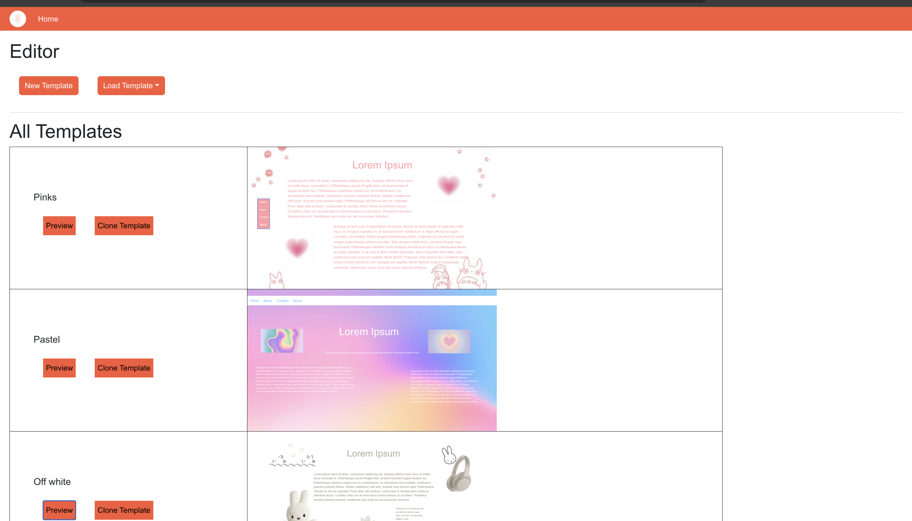

# Technical Specification


Anushree Umak - 21343003

Ho Yan Woo 20110804


## Table of contents

Table of contents	
1. [Introduction](#introduction)

   1.1. Overview

   1.2. Glossary	

2. System Architecture	

   2.1. Data Flow Diagram	

   2.2. High-level System Architecture

3. High-Level Design	

   3.1. User Navigation Flow

4. Problems and Resolution	
5. [Installation Guide](##5. Installation Guide)

	


## 1. Introduction
### 1.1 Overview
The product we developed, known as Codease, is a website designed to help users create their web pages for those who have little to no coding experience. Codease simplifies the process of designing webpages through a user-friendly interface. Users can effortlessly edit elements such as navigation bars, text, and media, allowing them to customise the website as they wish.
Our core feature known as the Template Editor, allows users to create custom designs and manipulate webpage elements to create their desired website. The Template Editor comes with an additional feature where users can select from a repository or already created templates from which they can browse, edit or use as a starting point for their designs.
Codease is a system that is designed to mainly focus on user-friendliness as it caters to users who lack programming knowledge but still wish to make their interactive web page designs. The system allows users to achieve these features through the Template Editor and the repository filled with already completed templates; aside from these features Codease also consists of a login page which comes along with an OTP verification system for secure access, a main page that acts as a hub for navigation with can also be found on the navigation bar and user account setting for users to manage and personalise their profile. Codease also offers a tutorial for first-time users, to allow a smooth transition into learning the functionalities of the website, however, even if a user were to return after a long period, each feature is clearly labelled so that even long-term users can return and still be comfortable the feature with the help of our labels and easily universally identifiable symbols. 


### 1.2 Glossary


**User-friendly interface**: A software where the user can understand with ease and navigate through the application with little to no problems

**Template Editor**: Software that lets users create or modify web pages. 

**Repository**: A storage location for a collection of pre-designed templates.

**OTP verification system**: A security system that sends a One-Time Password to the user's email to verify their identity, which they must input on the website. Once they are confirmed that it is the same the user is verified.

**Data flow diagram**: A graphical representation of how data transfers/moves/ transitions from one component to another.

**Frontend**: The part of a website that users interact with directly, in this case, it is the template editor. 

**Backend**: The backend is the server side that processes data and sends it to the frontend, in this case, is it the user account settings, the OTP, premade templates and its template editors' ability to save and load. 

**React JS**: A JavaScript library mainly used for building dynamic user interface web pages.

**Django**: A Python web framework that we used for the backend.

**UI (User Interface)**: The interactions that occur between humans and machines.

**Admin page**: A webpage that we can access with the help of Django's built-in features which allows us to manage the website, and view user information and settings.

**Visual Studio Code (VSCode)**: A source-code editor.

**Clone the Project Repository**: Download a copy of the code from an online repository known as GitLab.

**Makemigrations & Migrate**: These Django commands are used to prepare and apply changes to the database.

**Node.js and np**m: Node.js is an environment created for executing JavaScript code server-side, and npm is its package manager, used for installing JavaScript packages.


## 2. System Architecture
### 2.1 Data Flow Diagram


All the components of the system are shown below in the data flow diagram. The diagram depicts in detail how data is transitioned/ translated and moved through each component. We start with the user who inputs data about themselves, for the first time user account verification is required but the user who already has a login is then taken to the main hub. This page links everything together, The user can access the template editor and user account settings through the main hub; while doing so it is all linked to the database that constantly gets updated when users use the template editor. 

### 2.2 High-level System Architecture  


This diagram provides a detailed overview of the components, focusing on the software utilized for the front end and backend. The UI aims to offer a user-friendly experience, as detailed in the following section. For the front end, React JS was chosen for its interactive capabilities and ease of use with JavaScript. On the backend, we leveraged Django's robust built-in features to streamline development.


## 3. High-Level Design

### 3.1 User Navigation Flow





Both diagrams show the UI and how users will navigate Codease, the main hub and the constant navigation bar on the top of most web pages will help users easily go to their desired page with little to no effort.


## 4. Problems and Resolution

_**Problem 1** - Specifying the exact features of the editor_

As there can be countless features we could add to the editor, however, we had to specify which ones to add which proved to be quite a challenge as it was a struggle between the time constraint and also wanted to create a website where users could have endless possibilities.

_Solution_ 

After a lot of discussions and talking to family and friends with no coding experience. We narrowed down the features to the ones we thought were of the utmost importance to have. 

_**Problem 2**_- _Displaying information about all the users_

After the backend was done, to add users we noticed the only way to do so was by manually letting each user log in one by one and to view their information after they logged in also seemed difficult. 

_Solution_

After a lot of testing and research, we ensured that this was added to the user account settings and viewing all users could only be done through the admin page to increase security.

_**Problem 3** - Having an email to send out OTPS_

Most emails such as Gmail, Outlook and Hotmail have a lot of security features to protect however that also means there is only a limited number of how many emails that can go through before the account gets flagged

_Solution_ 

After thoroughly researching and evaluating various email services, we decided to use Gmail for the OTP functionality. To this end, we created a dedicated Gmail account specifically for sending OTPs and adjusted its security settings to enable the dispatch of numerous emails without triggering spam filters.

_**Problem 4** - Integrating both backend and frontend_

To be able to save the templates properly we had to integrate Django and react.js, which was a lot more difficult than we originally thought

_Solution_

After a lot of trial and error, we were finally able to integrate both with a lot of research through the admin page.


_**Problem 5** - Using emails for testing_

When it came to testing to ensure the OTP system worked, we found that couldn’t use the same email twice due to security measures and creating a new email every time we needed to see if a feature was working was tiresome.

_Solution_

After some research, we discovered temporary email addresses that last 1-2 hours and were perfect for the type of testing we needed them for, as we only needed to see if our features worked every time we edited or added something new. The use of temporary 


_**Problem 6** - Having too many files and folders in one place_.

As the frontend and backend were placed in the same folder, which in itself has many more files and folders. Over time it became difficult to link one file to another, or save photos and call them to other javascript files or python files.

_Solution_

We used static folders to store all images, along with organising all templates into one folder for templates. We also combined all javascript components into one component to avoid confusion and reduce cluttering all files into one folder.  


## 5. Installation Guide


Hardware: Mac computer with macOS Sonoma version 14.1.2 installed.

Software: Visual Studio Code (VSCode), Python 3.6+, Node.js and npm

**Set-up Instructions**

```
Install VScode - Download VSCode from the official website and follow the installation instructions.
Clone the Project Repository - git clone https://gitlab.computing.dcu.ie/wooh2/2024-ca326-aumak-customwebpagegenerator.git
Set up Django - pip install -r requirements.txt
Set up React js - npm install
```

**Start-up Instructions**
```
python manage.py makemigrations
python manage.py migrate
python3 manage.py runserver
npm start
Open the browser to the link - http://127.0.0.1:8000/
```
