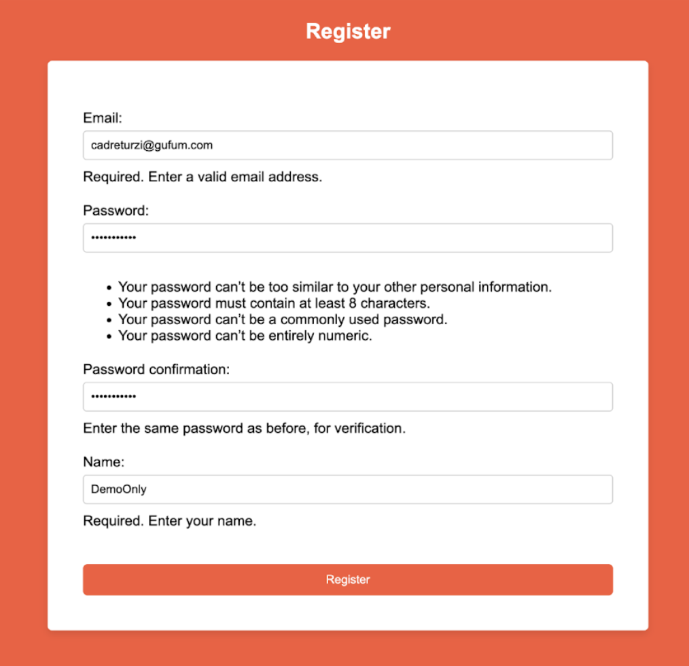

# User Manual

## 1. List of contents

1. [List of contents](#1-list-of-contents)
2. [Log in page](#2-log-in-page)	
3. [Registering Users](#3-registering-users)	
4. [Template Editor](#4-template-editor)

## 2. Log in page 

The first thing a user will see when they open our website is the option to log in if they already have an account, or register if they do not. 

For new users who need to register, they will need to select the 'Register' button, which will direct them to another page. On the subsequent page, they will be prompted to provide basic information such as their name, password (which must be entered twice for confirmation), and email address. The name provided will serve as their identifier on the platform. Users need to ensure that the email address they provide is accurate, as it will be used for verification purposes later.

## 3. Registering Users

In the user guide, I've utilized a temporary email address and the name 'testing' merely for demonstration purposes. 

When users register, it is essential they input their own name and email address accurately. While the password requirements may seem stringent, they're intended to prompt users to create a more secure password that they can remember. Upon entering these details and clicking 'register,' users will need to check their email inbox.
Using a temporary email address online, I received an OTP (One-Time Password) in my inbox. This OTP is a six-digit code and should not be shared with anyone. It's utilized by the website to verify the user's email address. Users will need to copy the OTP sent to them and return to the website to enter it, as demonstrated below.

After entering the correct OTP, both the email address and user are verified, and the user's account is promptly created.
Upon successful account creation, users are directed to a page where they can choose from a variety of templates.

## 4. Template Editor

The user has the option to either select an existing template or create their own. If they choose to create their own template, they will be directed to a page where they can utilize the elements provided below to design their own web page.

Horizontally across the page, you will find commonly used symbols representing various features. These features include the ability to change the background color, text color, and text size, as well as add links, delete unwanted elements, create new templates, save, load, and download templates, as respectively shown.
Even if users are unable to recognize the symbols, they can still identify each feature by hovering over them. Upon hovering, a label describing the feature's function will appear. An example of this functionality can be found below.

Returning to the template editor, vertically aligned are various elements that users can add to their webpage, enhancing its interactivity and user-friendliness. The text box allows users to insert any type of text, ranging from headings to descriptions. Users can customize the appearance of this text using the features previously demonstrated in the horizontal navbar. Additionally, users have the option to add their own navbar. Below, a selection of basic templates is showcased, allowing users to choose one they prefer and customize it to their personal preference.

Users can also incorporate images into their web pages by adding the image link. This eliminates the need to allocate additional space or learn coding for embedding images, streamlining the process. Furthermore, users can resize the image to their preferred dimensions, as demonstrated below.

This user guide covers every interaction consumers may have with Codease. With Codease, users can effortlessly create their own web pages without the need to learn a new programming language or navigate complex applications. Simply by registering, users can design their desired webpage with minimal effort and download it upon completion.
