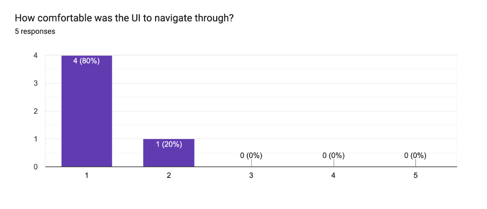

## Introduction 

This report details the user testing conducted through a Google Form to gauge user opinions and needs regarding Codease. By guiding users through the website and having them anonymously respond to questions, we gained valuable insights into our system from a user's perspective. We designed the questionnaire with mostly multiple-choice questions to ensure it was concise and user-friendly. The survey was distributed to a mixed group of friends and family, including both technical and non-technical users, to obtain a diverse range of feedback on their experience with the system.

Here is the link to the spreadsheet of all the answers we collected from our users - spreadsheet 

## Questions and Answers

_Question 1 - Were you able to log in easily?_	

Out of the 5 users, all 5 of them were able to easily log in with no issues. 

_Question 2 - Did you have any difficulty registering your account?_

All the users who tested the system had no difficulty registering their accounts.

_Question 3 - Where did you face difficulty when registering?_

This question was presented to users who had difficulty registering, however, since no users had any difficulty registering we did not receive any comments in this section of the questionnaire.

_Question 4 - How comfortable was the UI to navigate through?_

As you can see from the bar chart, from a 1 to 5 rating with 1 being comfortable and 5 being uncomfortable. 4 users found the UI to be very easy and comfortable to navigate through while one user did not feel as comfortable but was still close by giving us a score of 2.
	
_Question 5 - Were you able to easily create your own templates?_

All users were able to easily create their own templates, with all users opting for yes.

_Question 6 - How useful was it to have pre-made templates?_

All 5 users found the pre-made templates very useful as they all gave us a score of 1; with 1 being useful and 5 being not useful. 

_Question 7 - Did you find the features in the editor easily identifiable based on their labels and universally recognized symbols?_	

Everyone that used the system and did the questionnaire stated that they found the features to be easily identifiable and had no difficulty understanding them and their function. 

_Question 8 - Did the provided elements, including the navbar, images, and text box, suffice for creating your desired website? Were you able to customise them to your satisfaction?_

An issue we had from the start was finding out how many elements we could create as there is really no limit to how many we could have created so we are happy to know that out of the 5 users that tested all 5 of them were very happy with our choice of elements that we picked as even though they were limited, however they ability of customization helped users create their desired websites with no limitations.  
	
_Any last comments or suggestions?_

None of the users left any comments.

If we were to conduct testing again, we would incorporate unit testing for more definitive results. Additionally, for user testing, we would distribute the form to a broader audience, as feedback from just five individuals is insufficient for comprehensive insights.

